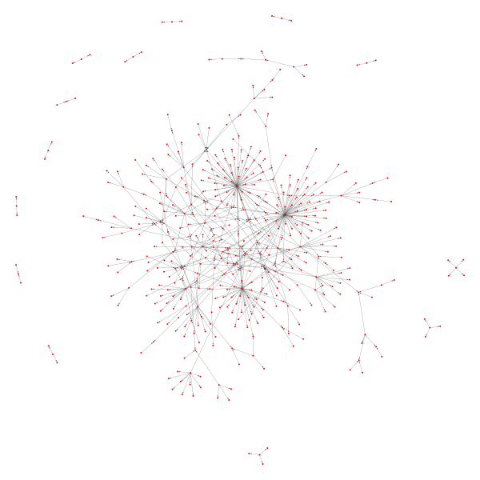

# TikTok Stitch Graph 🎵

In recent times, with the introduction of TikTok, Instagram reels, YouTube Shorts etc., short-form videos have become one of the main mediums for public discourse. This poses an interesting challenge, as understanding the contents of these videos analytically requires analyzing both the visual, auditory, and textual components of the content. Furthermore, platforms such as TikTok allows for responding to other videos through *“stitches”*, creating a network-like structure, where videos can respond to other videos. Fully grasping the nature of such a network requires understanding both the topological structure of the TikTok stitch network, along with the individual contents of each video. That is what this project aims to explore. Using video content, how can we improve our understanding of how people communicate using stitches? To this end, we will use a combination of image processing, NLP methods and network analysis. 

<\

## Project pipeline

```mermaid
%%{init: {'theme': 'dark', 'themeVariables': { 'primaryColor': '#4f98ca', 'edgeLabelBackground':'#2b2b2b', 'nodeTextColor': '#ffffff', 'background': '#1e1e1e'}}}%%

graph TD
    A[🤓 Start: Setup TikTok API Access ] --> B[📝Collect Hashtag Videos using get_hashtag.py]
    click A href "https://github.com/Marcus-Friis/thesis/tree/cleanup?tab=readme-ov-file#tiktok-api" "click A"
    click B href "https://github.com/Marcus-Friis/thesis/tree/cleanup?tab=readme-ov-file#get-hashtag-stitches" "hi"


    B --> C[🤏Extract edges using get_edges.py]
    C --> D[🤏Extract targets using get_targets.py]
    D --> G[📎Combine sources & targets using compose_vertices_files.py]
    G --> P[(File storage)]
    P -->  E[🔽Download Videos using download_tiktok_vidoes.py]
    P -->  H[📈Perform Graph Analysis using graph_analysis.py <br> obtaining metrics and plots]
    E --> J[✂Split videos into stichee and stitcher]
    J --> I[🎅Do stuff with stuff??]

    click A href "https://github.com/Marcus-Friis/thesis/tree/cleanup?tab=readme-ov-file#tiktok-api" "click A"

    click B href "https://github.com/Marcus-Friis/thesis/tree/cleanup?tab=readme-ov-file#get-hashtag-stitches" "hi"
```




## TikTok API
### Getting started
The [TikTok API documentaiton](https://developers.tiktok.com/doc/about-research-api/) describes how to use it. We have created a [notebook](/notebooks/1.0-mahf-tiktok-api-fun.ipynb) to explore the use of this API. 

### Setup TikTok API access
To access TikTok API, you need a `client_key` and `client_secret`. These are to be put in a `/secrets/` directory. To set this up, copy [`/secrets_template/`](/secrets_template/) as such
```
cp -r secrets_template secrets
```
Fill out the `/secrets/tiktok.json` file with your secrets, and it should work.


### Get Hashtag stitches

The script [`get_hashtag.py`](/src/get_hashtag.py) scrapes TikTok videos (that are stitches) using a specific hashtag.


#### Usage

```bash
python src/get_hashtag.py HASHTAG_NAME
```

- `HASHTAG_NAME`: The hashtag to scrape (required).


The script scrapes videos between `2024-05-01` and `2024-05-31` and saves them as `{hashtag}.json` in the [`data/` directory](/data/hashtags/vertices/sources).

##### Example

```bash
python src/get_hashtag.py cooking
```

### Stitch Edge Scraper

The script [`get_edges.py`](/src/get_edges.py) scrapes stitch relationships between TikTok videos using previously downloaded data.

#### Usage

```bash
python src/get_edges.py HASHTAG_NAME [START_INDEX]
```

- `HASHTAG_NAME`: The hashtag to use (required).
- `START_INDEX`: Optional index to resume scraping from.

The script processes videos from `{hashtag}_.json` and outputs the edges (stitcher -> stitchee) to `{hashtag}_edges.txt`.

##### Repair Mode

To repair incomplete edges:

```bash
python src/get_edges.py HASHTAG_NAME repair
```


### Helper script for quickly downloading videos

[`download_tiktok_videos.py`](/src/download_tiktok_videos.py) is a simple script for quickly querying and downloading videos.

#### Usage

Run the script from the project root with the following command:

```bash
python src/download_tiktok_videos.py --start_date YYYYMMDD --end_date YYYYMMDD [options]
```

#### Options:

- `--start_date`: Start date for the query in `YYYYMMDD` format (required).
- `--end_date`: End date for the query in `YYYYMMDD` format (required).
- `--max_count`: Maximum number of videos to retrieve (optional, default is 10).
- `--region_code`: Region codes to filter by (optional).
- `--hashtag_name`: Hashtags to filter by (optional).
- `--keyword`: Keywords to filter by (optional).
- `--video_length`: Video lengths in seconds to filter by (optional).
- `--username`: Usernames to filter by (optional).

#### Example
```bash
python src/download_tiktok_videos.py --start_date 20240101 --end_date 20240110 --max_count 10 --keyword "stitch with"
```

### Graph Analysis. 

The script [graph_analysis.py](src/graph_analysis.py) produces various metrics for our graphs. It produces metrics for both the video- and user graph.  

#### Usage

```bash
python src/graph_analysis.py HASHTAG_NAME [CREATE_PLOTS] [DO_PROJECTION]
```
#### Arguments:
- `HASHTAG_NAME`: **(Required)**  Specifies the hashtag graph(s) to use. You can provide one or multiple hashtag names in the form:
    -  `hashtag_1 hashtag_2 ... hashtag_n`.

Alternatively, you can use `all` to run the script on all hashtag graphs located in [the vertices folder.](data/hashtags/vertices/)

- `CREATE_PLOTS`: **(Optional)**  Set to `true` to generate plots for the specified hashtags. If not provided or set to `false`, no plots will be created.

- `DO PROJECTION`: **(Optional)**  Use the keyword `project` to enable user projections. This feature performs analysis on user projections, which are based on users that have edges to the same vertice.

Example usage: `python src/graph_analysis.py all true project` <br>
The above example will perform graph analysis on all hashtags, as well as their projections, and plots everything.

### Graph Embeddings
This script [graph_embed.py](src/graph_embed.py) allows you to embed graphs using various algorithms and provides additional options for graph manipulation, visualization, and clustering. It embeds all the graphs created from the hashtags located it in [the vertices folder.](data/hashtags/vertices/)

```bash
python src/graph_embed.py ALGORITHM [DIRECTED][CREATE_PLOTS][ADD_RANDOM][CLUSTER][SAVE_PLOT][HELP]
```
#### Arguments:
- `ALGORITHM`: **(Required)**. Which embedding algorithm to use. Available algorithms:
    - graph2vec
    - feathergraph
    - sf
    - fgsd
    - gl2vec
    - ldp
- `DIRECTED`: **(Optional)**: By default, the script uses undirected graphs. To enable directed graphs, include the keyword directed.  
- `CREATE_PLOTS` **(Optional)**: If you want to generate a 2D plot of the embeddings, include the keyword `plot`. Without this argument, no plots will be generated.
- `ADD_RANDOM`: **(Optional)** If you want to add random graphs to the dataset, use the `random` argument. 
- `CLUSTER`: **(Optional)** This option allows you to cluster the generated embeddings using the HDBSCAN algorithm. To activate it, use the keyword `cluster`.
- `SAVE_PLOT`: **(Optional)**: By default, any generated plots are displayed interactively. If you prefer to save the plot as a file instead of displaying it, include the `save` keyword. 
- `HELP`:  **(Optional)**: Use the `help` argument to display usage instructions, including the accepted algorithms and available options. 


### How Argument Parsing Works
These scripts ([graph_analysis.py](src/graph_analysis.py) & [graph_embed.py](src/graph_embed.py)) use a flexible, keyword-based argument system. Instead of requiring flags (e.g., --flag), users can input keywords directly, with the order being unimportant and case ignored (e.g., true or True both work). The scripts scan for specific keywords to activate different features or modes of operation.