# TikTok StitchGraph 🎵

In recent times, with the introduction of TikTok, Instagram reels, YouTube Shorts etc., short-form videos have become one of the main mediums for public discourse. This poses an interesting challenge, as understanding the contents of these videos analytically requires analyzing both the visual, auditory, and textual components of the content. Furthermore, platforms such as TikTok allows for responding to other videos through *“stitches”*, creating a network-like structure, where videos can respond to other videos. Fully grasping the nature of such a network requires understanding both the topological structure of the TikTok stitch network, along with the individual contents of each video. That is what this project aims to explore. Using video content, how can we improve our understanding of how people communicate using stitches? To this end, we will use a combination of image processing, NLP methods and network analysis. 


## Project pipeline

```mermaid
%%{init: {'theme': 'dark', 'themeVariables': { 'primaryColor': '#4f98ca', 'edgeLabelBackground':'#2b2b2b', 'nodeTextColor': '#ffffff', 'background': '#1e1e1e'}}}%%

graph TD
    
    %% Define each step in the pipeline

    A[🤓 Start: Setup TikTok API Access] 
    AA[🔷Twitter/X edgelist & graph creation]
    B[📝Collect Hashtag Videos using get_hashtag.py]
    C[🤏Extract edges using get_edges.py]
    D[🤏Extract targets using get_targets.py]
    E[📎Combine sources & targets using compose_vertices_files.py]
    F[(TikTokFile storage)]
    FF[(Twitter/X storage)]
    G[🔽Download Videos using download_tiktok_vidoes.py]
    H[📈Perform Graph Analysis using graph_analysis.py <br> obtaining metrics and plots]
    I[✂Split videos into stichee and stitcher]
    J[🗣️Get Transcriptions]
    K[🙈Perform Sentiment Analysis]
    L[📊Embed the graphs]
    M[👨‍🤝‍👨🏽Perform Cluster Analysis]
    N["⛏️Transactional Graph Mining<br>
    *This is done on:*<br>
    - Raw TikTok/Twitter Graph<br>
    - TikTok/Twitter graph with sentiment edges"]

    Final(((Final findings & dataset)))
    

    %% I dont know the alphabet
    %% MNOPQRTSUVXYZ

    %% Connect the steps together

    A --> B
    AA --> FF
    B --> C
    C --> D
    D --> E
    E --> F
    F --> G
    F --> H
    FF --> H
    FF --> L
    FF --> N
    G --> I
    I --> J
    J --> K
    F --> L
    L --> M
    F --> N
    K --> N

    N --> Final
    M --> Final
    H --> Final
   %% Add hrefs to the steps


    click A href "https://github.com/Marcus-Friis/thesis/tree/cleanup?tab=readme-ov-file#tiktok-api" "click A"

    click B href "https://github.com/Marcus-Friis/thesis/tree/cleanup?tab=readme-ov-file#get-hashtag-stitches" "click B"

    click C href "https://github.com/Marcus-Friis/thesis?tab=readme-ov-file#stitch-edge-scraper" "click C"

    click D href "https://github.com/Marcus-Friis/thesis?tab=readme-ov-file#extract-targets" "click D"

    click E "https://github.com/Marcus-Friis/thesis?tab=readme-ov-file#script-1-stitcher-and-stitchee-data-processing" "click E"

    click F "https://github.com/Marcus-Friis/thesis/tree/main/data" "click F"

    click G "https://github.com/Marcus-Friis/thesis?tab=readme-ov-file#helper-script-for-quickly-downloading-videos" "click G"

    click H "https://github.com/Marcus-Friis/thesis?tab=readme-ov-file#graph-analysis" "click H"

    click I "https://github.com/Marcus-Friis/thesis?tab=readme-ov-file#split-videos-into-sticher-and-stichee" "click I"

    %%click J "" "click J"


```




# TikTok API
### Getting started
The [TikTok API documentaiton](https://developers.tiktok.com/doc/about-research-api/) describes how to use it. We have created a [notebook](/notebooks/1.0-mahf-tiktok-api-fun.ipynb) to explore the use of this API. 

### Setup TikTok API access
To access TikTok API, you need a `client_key` and `client_secret`. These are to be put in a `/secrets/` directory. To set this up, copy [`/secrets_template/`](/secrets_template/) as such
```
cp -r secrets_template secrets
```
Fill out the `/secrets/tiktok.json` file with your secrets, and it should work.


## Get Hashtag stitches

The script [`get_hashtag.py`](/src/get_hashtag.py) scrapes TikTok videos (that are stitches) using a specific hashtag.


#### Usage

```bash
python src/get_hashtag.py HASHTAG_NAME
```

- `HASHTAG_NAME`: **(Required)** The hashtag to scrape.


The script scrapes videos between `2024-05-01` and `2024-05-31` and saves them as `{hashtag}.json` in the [`data/` directory](/data/hashtags/vertices/sources).

##### Example

```bash
python src/get_hashtag.py cooking
```

## Stitch Edge Scraper

The script [`get_edges.py`](/src/get_edges.py) scrapes stitch relationships between TikTok videos using previously downloaded data.

#### Usage

```bash
python src/get_edges.py HASHTAG_NAME [START_INDEX]
```

- `HASHTAG_NAME`: **(Required)** The hashtag to use.
- `START_INDEX`: **(Optional)** Index to resume scraping from.

The script processes videos from `{hashtag}_.json` and outputs the edges (stitcher -> stitchee) to `{hashtag}_edges.txt`.

##### Repair Mode

To repair incomplete edges:

```bash
python src/get_edges.py HASHTAG_NAME repair
```

## Extract targets
The [get_targets.py](src/get_targets.py) script processes a list of TikTok video URLs to extract **stitchee** video IDs—the videos that have been stitched by other users (**stitchers**). It then collects detailed data about these stitchee videos over specified date intervals using the TikTok API. The aggregated data is saved into a JSON file for further analysis.
#### Arguments
- `HASHTAG_NAME` **(Required)**: Specifies the hashtag for which video data will be retrieved.
- `BATCH_SIZE` **(Optional)**: Specifies the number of video IDs to process in each API request batch. Defaults to *10,000*

#### Usage
```bash
python get_targets.py cooking 5000
```
This will retrieve information for the stitchee videos associated with the *cooking* hashtag, processing 5,000 video IDs per API request batch.

## Script for downloading TikTok videos

[`download_tiktok_videos.py`](/src/download_tiktok_videos.py) is a simple script for quickly querying and downloading videos.

#### Usage

Run the script from the project root with the following command:

```bash
python src/download_tiktok_videos.py --start_date YYYYMMDD --end_date YYYYMMDD [options]
```

##### Arguments:

- `--start_date`: **(Required)** Start date for the query in `YYYYMMDD` format.
- `--end_date`: **(Required)** End date for the query in `YYYYMMDD` format (required).
- `--max_count`: **(Optional)** Maximum number of videos to retrieve. *Default = 10*
- `--region_code`: **(Optional)** Region codes to filter by.
- `--hashtag_name`: **(Optional)** Hashtags to filter by.
- `--keyword`: **(Optional)** Keywords to filter by.
- `--video_length`:  **(Optional)** Video lengths in seconds to filter by.
- `--username`: **(Optional)** Usernames to filter by.

#### Example
```bash
python src/download_tiktok_videos.py --start_date 20240101 --end_date 20240110 --max_count 10 --keyword "stitch with"
```

## Graph Analysis

The script [graph_analysis.py](src/graph_analysis.py) produces various metrics for our graphs. It produces metrics for both the video- and user graph.  

#### Usage

```bash
python src/graph_analysis.py HASHTAG_NAME [CREATE_PLOTS] [DO_PROJECTION]
```
#### Arguments:
- `HASHTAG_NAME`: **(Required)**  Specifies the hashtag graph(s) to use. You can provide one or multiple hashtag names in the form:
    -  `hashtag_1 hashtag_2 ... hashtag_n`.

Alternatively, you can use `all` to run the script on all hashtag graphs located in [the vertices folder.](data/hashtags/vertices/)

- `CREATE_PLOTS`: **(Optional)**  Set to `true` to generate plots for the specified hashtags. If not provided or set to `false`, no plots will be created.

- `DO PROJECTION`: **(Optional)**  Use the keyword `project` to enable user projections. This feature performs analysis on user projections, which are based on users that have edges to the same vertice.

Example usage: `python src/graph_analysis.py all true project` <br>
The above example will perform graph analysis on all hashtags, as well as their projections, and plots everything.

## Graph Embeddings
This script [graph_embed.py](src/graph_embed.py) allows you to embed graphs using various algorithms and provides additional options for graph manipulation, visualization, and clustering. It embeds all the graphs created from the hashtags located it in [the vertices folder.](data/hashtags/vertices/)

```bash
python src/graph_embed.py ALGORITHM [DIRECTED][CREATE_PLOTS][ADD_RANDOM][CLUSTER][SAVE_PLOT][HELP]
```
#### Arguments:
- `ALGORITHM`: **(Required)**. Which embedding algorithm to use. Available algorithms:
    - graph2vec
    - feathergraph
    - sf
    - fgsd
    - gl2vec
    - ldp
- `DIRECTED`: **(Optional)**: By default, the script uses undirected graphs. To enable directed graphs, include the keyword directed.  
- `CREATE_PLOTS` **(Optional)**: If you want to generate a 2D plot of the embeddings, include the keyword `plot`. Without this argument, no plots will be generated.
- `ADD_RANDOM`: **(Optional)** If you want to add random graphs to the dataset, use the `random` argument. 
- `CLUSTER`: **(Optional)** This option allows you to cluster the generated embeddings using the HDBSCAN algorithm. To activate it, use the keyword `cluster`.
- `SAVE_PLOT`: **(Optional)**: By default, any generated plots are displayed interactively. If you prefer to save the plot as a file instead of displaying it, include the `save` keyword. 
- `HELP`:  **(Optional)**: Use the `help` argument to display usage instructions, including the accepted algorithms and available options. 

## Split videos into sticher and stichee
The script [split_videos.py](src/split_videos.py) processes videos by detecting scene boundaries and splitting the videos into two parts: the "stitcher" and the "stitchee." It uses the AdaptiveDetector from [scenedetect](https://www.scenedetect.com/docs/latest/index.html) to find scene transitions and can apply custom thresholds for scene detection. If no significant scenes are detected, a default split at 5 seconds is applied. The default of 5 seconds are due to the nature of stitches; a stitch can be a maximum of 5 seconds long. 

#### Usage
```bash
python split_videos.py HASHTAG_NAME [START_INDEX]
```

#### Arguments
- `HASHTAG_NAMAE` **(Required)**: Specifies the hashtag folder containing the videos to process. The script looks for videos in the directory `../data/hashtags/videos/HASHTAG_NAME`.
- `START_INDEX` **(Optional)**: This specifies from which index (0-based) to start processing the videos. This can be useful if you want to resume splitting from a specific video. Defaults to 0. 

## Video Transcription Script
This script [get_transcriptions.py](src/get_transcriptions.py) processes videos for a specific hashtag, transcribes their audio using the [Whisper](https://github.com/openai/whisper) model, and saves the transcriptions to a text file. It can handle multiple videos at once and supports resuming the process from a specific index.

#### Usage
```bash
python transcribe_videos.py HASHTAG_NAME [START_INDEX]
```

#### Arguments
- `HASHTAG_NAME` **(Required)**: The name of the hashtag folder containing the videos to transcribe. The script looks for videos in: <br> `data/hashtags/videos/HASHTAG_NAME/split directory`.

- `START_INDEX`: **(Optional)**: The index from which to start processing videos (0-based). This allows you to resume transcription if the process was interrupted. Defaults to `0` if not specified.


## Sentiment Analysis for Video Transcriptions

The script [sentiment.py](src/sentiment.py) analyzes the sentiment of video transcriptions associated with a given hashtag. It reads transcriptions, uses [VADER Sentiment Analysis](https://github.com/cjhutto/vaderSentiment) to classify them as positive, negative, or neutral, and outputs the results to a file.

#### Usage
```bash
python analyze_sentiment.py HASHTAG_NAME
```

#### Arguments
- `HASHTAG_NAME` **(Required)**: Specifies the hashtag folder for which the sentiment analysis will be performed. The script reads from the transcription file located at `../data/hashtags/videos/transcriptions/HASHTAG_NAME.txt`.

### How it works

The script reads from the path specified aboive, extracting every third line as transcription text. It uses the [VADER Sentiment Analysis](https://github.com/cjhutto/vaderSentiment) to score each transcription and classify it as positive, negative, or neutral based on the compound sentiment score. The classifications are saved to `../data/hashtags/videos/sentiments/HASHTAG_NAME_sentiment.txt`, with each line containing the video index and its sentiment.


## Smaller helper scripts
This section contains scripts that are useful for specific tasks but are not significant enough to warrant their own dedicated sections.
### Script 1: Stitcher and Stitchee Data Processing
The script [compose_vertices_files.py](src/compose_vertices_files.py) processes video data related to the "stitcher" and "stitchee" relationships from the hashtag's sources, targets, and edges files. It updates the JSON files in the vertices folder by adding information about which videos are stitchers and stitchees.
##### Usage: 
```bash
python compose_vertices_files.py HASHTAG_NAME
```
- `HASHTAG_NAME` **(Required)**: Which hashtag to work with. Currently only accept 1 hashtag at a time. 
#### What it does:
- Loads the sources, targets, and edges files for the given hashtag.
- Extracts stitcher and stitchee relationships.
- Updates the vertices file with this information for each video.
---
### Script 2: Graph Centralization and Projection (Graph Utils)
This script contains functions to calculate various centralization measures (degree, closeness, and betweenness) for undirected graphs using the igraph library. It also includes a function to project a graph onto its adjacency matrix. It contains four functions:
1) degree_centralization(G)
2) closeness_centralization(G)
3) betweenness_centralization(G)
4) project_graph(G)

These functions perform centralization analysis, checking for graph properties such as being undirected, simple, and having at least 3 vertices and 1 edge.
#### How to use:
```python
# Example with degree_centralization only. The syntax is exactly the same for the others as well. 
from graph_utils import degree_centralization 

G = ig.Graph.Full(10, directed=False)  # Example graph
degree_centrality = degree_centralization(G) # To project, do: project_graph(G). 
```
---
### Script 3:  TikTok Utils
The `tiktok_utils` script is not designed to be a standalone tool, but rather a utility module used across various scripts for TikTok-related data collection and scraping. It provides key functionalities such as interacting with the TikTok API and scraping stitch links using Selenium.<br>

#### Several scripts make use of tiktok_utils to handle specific tasks:
- `get_edges.py`: Uses `SourceScraper` from `tiktok_utils` to scrape stitch link relationships between TikTok videos.
- `get_hashtag.py`, `get_targets.py`, and `get_tiktok.py`: All utilize the `request_full` function to query TikTok videos based on filters like hashtags, usernames, regions, and keywords.

#### Key Features:
- `API Interaction`: Queries TikTok videos using the TikTok Research API with various filters (hashtags, usernames, keywords, etc.).
- `Stitch Link Scraping`: Scrapes stitch relationships between videos via Selenium, retrieving links between original and stitched videos.

This utility module streamlines video data collection and scraping for TikTok, serving as the core component behind these scripts.


## (NOT UPDATED) How Argument Parsing Works with sys.argv
These scripts ([graph_analysis.py](src/graph_analysis.py) & [graph_embed.py](src/graph_embed.py)) use a flexible, keyword-based argument system. Instead of requiring flags (e.g., --flag), users can input keywords directly, with the order being unimportant and case ignored (e.g., true or True both work). The scripts scan for specific keywords to activate different features or modes of operation.
